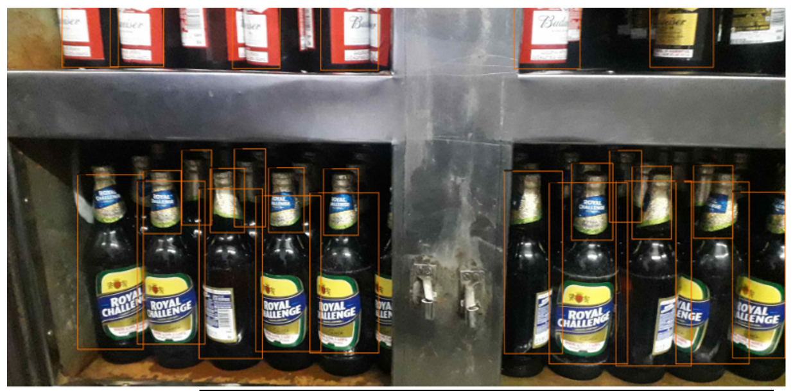
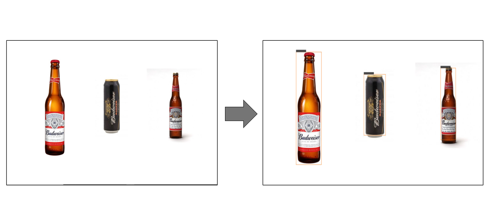

### Project Title

# Find the chillers (June 2020)

## Project structure
├── dataset\
│   ├── Product Images\
│   ├── SKUs\
│   ├── yolo\
├── images\
├── models\
│   ├──yolov3_custom.cfg\
│   └── yolov3.weights\
├── src\
│   └── main.ipynb\
│   └── generate_train\
├── submissions\
├── requirements.txt\
└── License

### Prerequisites

- GPU(s) with 16Gb RAM (e.g. Tesla V100)

```bash
pip install -r requirements.txt
```


### Overview
- We trained our model on provided images. 
- Used Yolov3 model for getting predictions.
- Since there were 20 products to predict we created datasets form each. 
- For more efficient sampling we used uniform random sampling.



